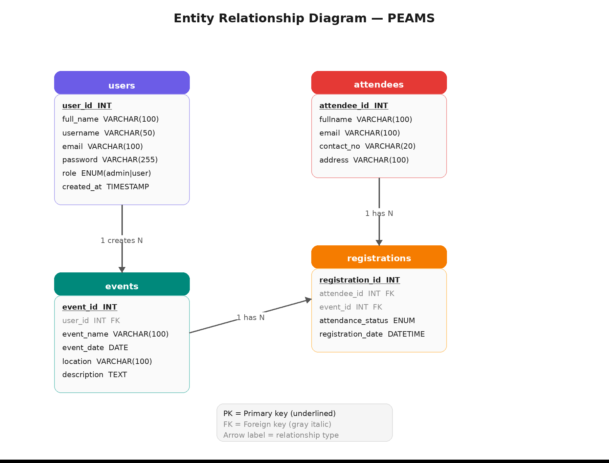
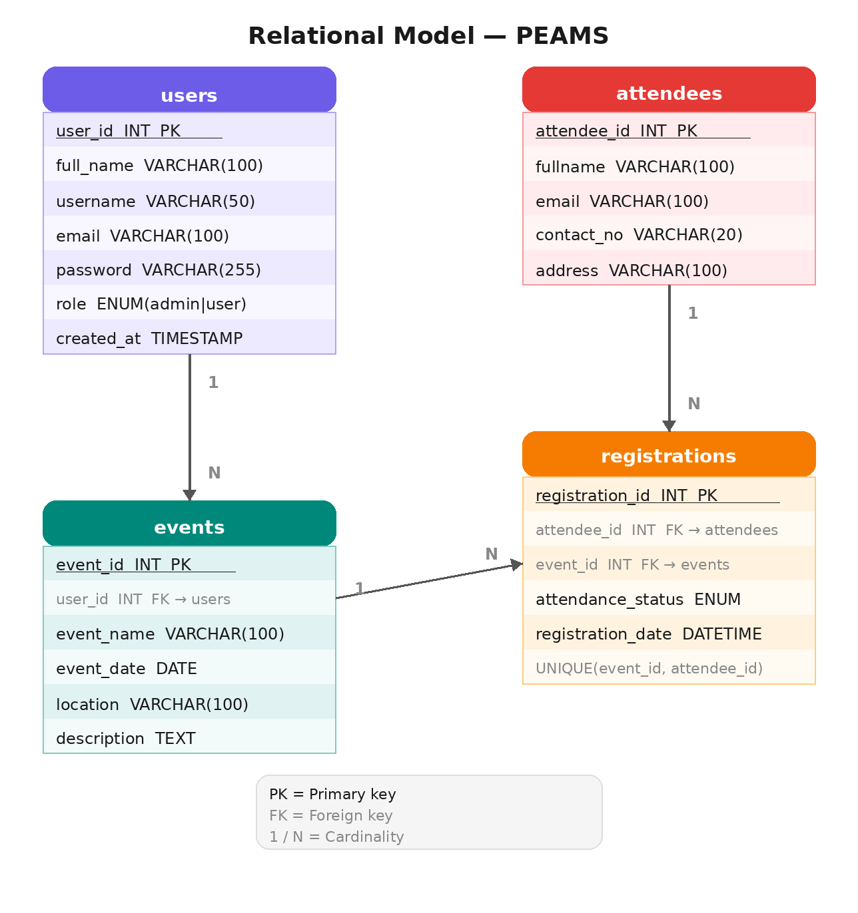

# Project-PEAMS
# Professional Events Attendance Management System

A web-based attendance tracking system that allows organizers to manage events, register participants, and monitor attendance.

---

## a. Introduction

### Background
Managing event attendance manually through paper-based sign-up sheets is inefficient, error-prone, and difficult to maintain over time. Organizations and academic institutions frequently struggle with tracking who attended which events, following up with absentees, and generating accurate attendance reports. This project addresses those challenges by providing a digital, database-driven solution.

### Problem Statement
The system aims to solve the following problems:
- Lack of a centralized platform for managing event information and attendance records
- Difficulty in tracking participant registration and check-in status across multiple events
- Absence of a reliable and searchable database for attendee information
- Inefficiency of manual attendance sheets that are prone to loss and human error

### Scope
The system covers the following:
- Creation, editing, and deletion of events by authorized users
- Registration and management of attendees
- Recording and updating of attendance status per event (`registered`, `present`, `absent`)
- Basic reporting of attendance statistics on the dashboard
- Role-based access control distinguishing `admin` and `staff` users

The system does **not** cover:
- Email or SMS notifications to attendees
- Payment or ticketing functionality

### Target Users
- **Admins** — Have full access to the system including user management; can create and manage events, attendees, and registrations
- **User** — Can manage events, attendees, and registrations but cannot access the Users management page
- **Attendees** — Individuals registered into the system by organizers; their attendance is tracked but they do not log in

---

## b. Project Objectives

### Primary Objective
To develop a functional web-based Events Attendance Management System using Python (Flask) and MySQL that enables organizers to efficiently manage events, register attendees, and track attendance.

### Secondary Objectives
- Implement full CRUD operations for all entities
- Establish a normalized relational database with at least 3 related tables
- Provide a user-friendly interface built with Bootstrap 5 for ease of navigation
- Implement role-based user authentication (`admin` and `staff`) to control access
- Enable search functionality for attendees, events, and registrations
- Handle duplicate registration attempts gracefully with user-facing error messages

---

## c. Business Rules

### Detailed Business Logic
- Only registered users (admins or staff) can log into the system and manage data
- Passwords are stored securely using bcrypt hashing
- An organizer can create, edit, and delete events
- Each event must have a unique name, a valid date, and a location
- Attendees are registered globally and can be linked to multiple events via registrations
- Each attendee can only be registered once per event (enforced by a `UNIQUE KEY` on `event_id + attendee_id`); attempting a duplicate registration shows a friendly error message instead of crashing
- Attendance status can be set to `registered`, `present`, or `absent`
- Only `admin`-role users can access the Users management page; `staff` users are redirected with an "Access denied" message

### Role Permissions

| Feature                        | Admin | Staff |
|-------------------------------|:-----:|:-----:|
| View Dashboard                | ✅    | ✅    |
| Manage Events (CRUD)          | ✅    | ✅    |
| Manage Attendees (CRUD)       | ✅    | ✅    |
| Manage Registrations (CRUD)   | ✅    | ✅    |
| View Users list               | ✅    | ❌    |
| Add / Edit / Delete Users     | ✅    | ❌    |

### Constraints
- `email` in the `attendees` table must be unique
- `username` in the `users` table must be unique
- A registration entry must reference a valid `event_id` and `attendee_id`
- Deleting a user cascades to delete their associated events
- Deleting an event or attendee cascades to remove related registration records

### Conditions
- A user must be logged in to access any management feature
- Session expires upon logout or browser close
- Attendance status defaults to `registered` upon creation

---

## d. Database Models

### Entity Relationship Diagram (ERD)


The ERD illustrates the following entities and relationships:
- **users** — stores organizer accounts; one user manages many events (1:N)
- **events** — stores event details; linked to users via `user_id` (FK)
- **attendees** — stores participant information; one attendee can have many registrations (1:N)
- **registrations** — bridge/junction table linking attendees to events; tracks attendance status

### Relational Model


| Table         | Attributes                                                                                                       |
|---------------|------------------------------------------------------------------------------------------------------------------|
| users         | **user_id** (PK), full_name, username, email, password, role, created_at                                        |
| events        | **event_id** (PK), *user_id* (FK → users), event_name, event_date, location, description                        |
| attendees     | **attendee_id** (PK), fullname, email, contact_no, address                                                      |
| registrations | **registration_id** (PK), *attendee_id* (FK), *event_id* (FK), attendance_status, registration_date |

---

## e. Project Overview

### Architecture
The application follows the **MVC (Model-View-Controller)** design pattern:
- **Model** — `database.py` handles the MySQL connection
- **View** — HTML templates (Jinja2 + Bootstrap 5) handle the user interface
- **Controller** — `app.py` contains all Flask routes that process requests and return responses

### Key Components

```
Project-PEAMS/
├── src/
│   ├── app.py                          # Flask routes and application logic
│   ├── database.py                     # MySQL connection helper
│   └── templates/
│       ├── login/
│       │   ├── index.html              # Dashboard
│       │   ├── login.html
│       │   └── register.html
│       ├── partials/
│       │   └── navbar.html
│       ├── users/
│       │   ├── users.html
│       │   ├── add_user.html
│       │   └── edit_user.html
│       ├── events/
│       │   ├── events.html
│       │   ├── add_event.html
│       │   └── edit_event.html
│       ├── attendees/
│       │   ├── attendees.html
│       │   ├── add_attendee.html
│       │   └── edit_attendee.html
│       └── registrations/
│           ├── registrations.html
│           ├── add_registration.html
│           └── edit_registration.html
├── database/
│   ├── schema.sql
│   └── initial_data.sql
├── docs/
│   └── diagram/
│       ├── erd.png
│       └── rm.png
└── README.md
```

### Routes Summary

| Method   | Route                       | Description                          | Auth          |
|----------|-----------------------------|--------------------------------------|---------------|
| GET      | `/`                         | Dashboard with summary counts        | ✅ Any user   |
| GET/POST | `/login`                    | Login page / authenticate            | ❌            |
| GET/POST | `/register`                 | Self-registration                    | ❌            |
| GET      | `/logout`                   | Clear session                        | ✅            |
| GET      | `/users`                    | List all users                       | ✅ Admin only |
| GET/POST | `/users/add`                | Add new user                         | ✅ Admin only |
| GET/POST | `/users/edit/<id>`          | Edit existing user                   | ✅ Admin only |
| GET      | `/users/delete/<id>`        | Delete user                          | ✅ Admin only |
| GET      | `/events`                   | List / search events                 | ✅ Any user   |
| GET/POST | `/add_event`                | Add new event                        | ✅ Any user   |
| GET/POST | `/edit_event/<id>`          | Edit event                           | ✅ Any user   |
| GET      | `/delete_event/<id>`        | Delete event                         | ✅ Any user   |
| GET      | `/attendees`                | List / search attendees              | ✅ Any user   |
| GET/POST | `/add_attendee`             | Add new attendee                     | ✅ Any user   |
| GET/POST | `/edit_attendee/<id>`       | Edit attendee                        | ✅ Any user   |
| GET      | `/delete_attendee/<id>`     | Delete attendee                      | ✅ Any user   |
| GET      | `/registrations`            | List / search registrations          | ✅ Any user   |
| GET/POST | `/add_registration`         | Register attendee to an event        | ✅ Any user   |
| GET/POST | `/edit_registration/<id>`   | Edit registration / update status    | ✅ Any user   |
| GET      | `/delete_registration/<id>` | Delete registration                  | ✅ Any user   |

---

## f. Setup Instructions

### Prerequisites
- Python 3.8 or higher
- XAMPP (includes MySQL and phpMyAdmin)
- Git
- Web browser (Chrome or Firefox recommended)

### Step-by-Step Installation

**1. Clone the repository**
```bash
git clone https://github.com/kellysldo/Project-PEAM.git
cd Project-PEAM
```

**2. Set up a virtual environment**
```bash
python -m venv venv
source venv/bin/activate        # macOS/Linux
venv\Scripts\activate           # Windows
```

**3. Install dependencies**
```bash
pip install -r requirements.txt
```

**4. Start XAMPP**
- Open XAMPP Control Panel
- Start **Apache** and **MySQL**

**5. Configure and import the database**
- Open your browser and go to `http://localhost/phpmyadmin`
- Create a new database named `CCCS105`
- Click **Import** → select `database/schema.sql` → click **Go**
- Click **Import** again → select `database/initial_data.sql` → click **Go**

**6. Configure environment variables**

In the `src/` directory, create a `.env` file by copying the provided example:
```bash
cp src/.env.example src/.env
```

Then open `src/.env` and confirm the values match your XAMPP setup:
```
DB_HOST=localhost
DB_USER=root
DB_PASSWORD=        # default XAMPP has no password
DB_NAME=CCCS105
```

> The application loads these values automatically at runtime using `python-dotenv`. Do **not** commit your `.env` file to version control.

**7. Run the application**
```bash
cd src
python app.py
```

**8. Access the application**

Open your browser and go to:
```
http://localhost:5000
```

---

## g. Team Members & Roles

| Name                    | Role                                        | Responsibilities                                                                               |
|-------------------------|---------------------------------------------|-----------------------------------------------------------------------------------------------|
| Kelly Saldo             | Fullstack Developer                         | Flask routes, database connection, CRUD logic, authentication, HTML templates, Bootstrap layout |
| Micabelle Allison Nomo  | Frontend Developer                          | HTML templates, CSS styling, Bootstrap layout, UI design, testing                              |
| Rizelyn Joy Borbe       | Backend Developer, Database & Documentation | ERD, relational model, SQL schema, initial data, README, testing, Flask routes, database connection |

---

## h. Dependencies

### Python Packages

| Package                | Version | Purpose                         |
|------------------------|---------|---------------------------------|
| Flask                  | 3.0.x   | Web framework                   |
| flask-bcrypt           | 1.x.x   | Password hashing                |
| mysql-connector-python | 8.x.x   | MySQL database connectivity     |
| python-dotenv          | 1.x.x   | Environment variable management |

### System Requirements
- OS: Windows 10/11, macOS 12+, or Ubuntu 20.04+
- Python: 3.8 or higher
- MySQL: 8.0 (via XAMPP)
- Browser: Chrome 110+, Firefox 110+, or Edge 110+

---

## i. Running Instructions

### Starting the Application
1. Open XAMPP → Start **Apache** and **MySQL**
2. Activate virtual environment:
```bash
source venv/bin/activate    # macOS/Linux
venv\Scripts\activate       # Windows
```
3. Navigate to `src/` and run:
```bash
python app.py
```
4. Open browser → `http://localhost:5000`

### Default Login Credentials

| Username | Password | Role  | Access Level                        |
|----------|----------|-------|-------------------------------------|
| admin    | admin123 | admin | Full access including user management |

> Staff accounts can be created by an admin through the Users page after logging in.

### Stopping the Application
- Press `Ctrl + C` in Terminal to stop the Flask server
- Stop Apache and MySQL in XAMPP Control Panel

### Navigating the Application
- **Dashboard** — Overview of total events, attendees, and registrations
- **Events** — View, add, edit, and delete events
- **Attendees** — View, add, edit, and delete attendees
- **Registrations** — Register attendees to events, update attendance status
- **Users** *(admin only)* — View, add, edit, and delete system user accounts
- **Logout** — End the current session

---

## j. Known Issues & Notes

- `attendance_status` values are stored in lowercase (`registered`, `present`, `absent`) matching the database ENUM definition. All UI dropdowns use these exact values.
- Attempting to register the same attendee to the same event twice will show a friendly error message — *"This attendee is already registered for that event."* — and keep the form open instead of crashing.
- The `/edit_registration/<id>` route fetches both the attendees and events lists to populate the dropdowns correctly.
- Passwords are hashed using `flask-bcrypt`. Do not manually insert plain-text passwords into the `users` table.
- Staff users who attempt to access admin-only pages (`/users`, `/users/add`, etc.) are automatically redirected with an "Access denied" flash message.
